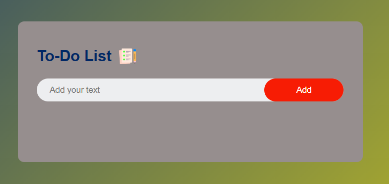

# 📝 TO-DO LIST Web Application

A simple and clean To-Do List web app built using **HTML**, **CSS**, and **JavaScript**. This project allows users to manage their daily tasks efficiently by adding, deleting, and marking tasks as completed.

## 🚀 Features

- ✅ Add new tasks
- ❌ Delete tasks
- 🔁 Mark tasks as completed
- 💾 Tasks persist using local storage
- 📱 Responsive design for mobile and desktop

## 📸 Demo

 <!-- Replace with actual screenshot if available -->

## 🛠️ Technologies Used

- HTML5
- CSS3
- JavaScript (ES6)
- Local Storage API

## 📂 Project Structure

TO-DO-LIST/
│
├── index.html # Main HTML file
├── style.css # Styling for the app
├── script.js # Main JavaScript logic
└── README.md # Project documentation


## 🔧 How to Use

1. Clone the repository:
   ```bash
   git clone https://github.com/SURIYA273/TO-DO-LIST.git
2.Open the project folder:

    cd TO-DO-LIST
    
3.Open index.html in your browser to start using the To-Do List.

🎯 Future Enhancements

✅ Add drag-and-drop task reordering

✅ Set deadlines and reminders for tasks

✅ User authentication and cloud sync

📬 Contact:

Created by SURIYA 

For feedback or collaboration, feel free to reach out via [LinkedIn](https://www.linkedin.com/in/suriya273) or [email](suriyamail273@gmail.com)

⭐️ Don’t forget to star this repo if you found it useful!


---

Let me know if you want me to add badges, a live preview link, or deployment instructions.


